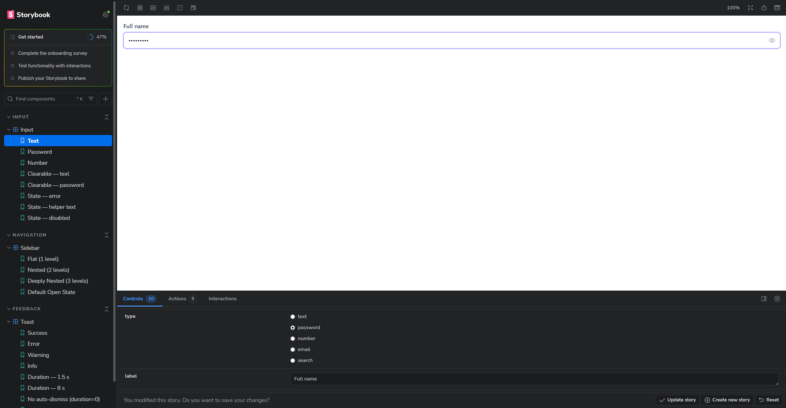
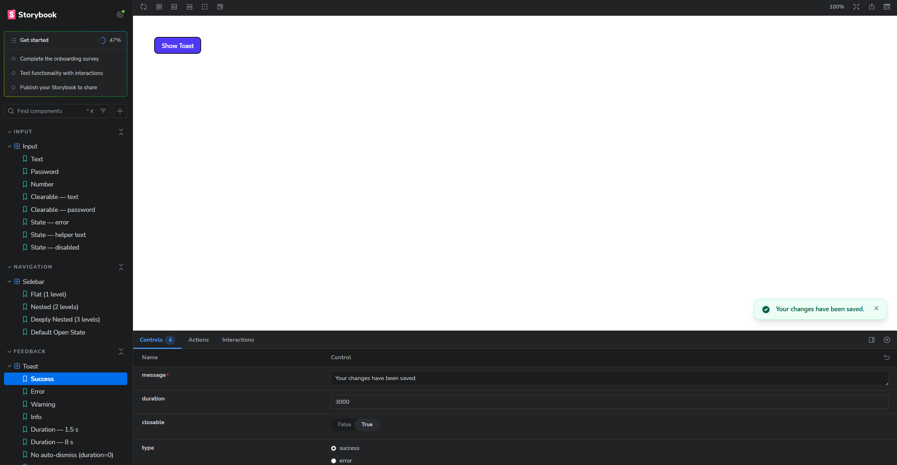
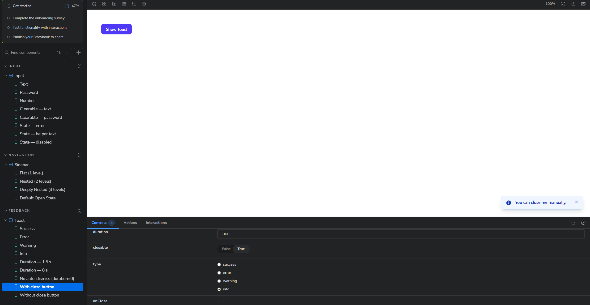
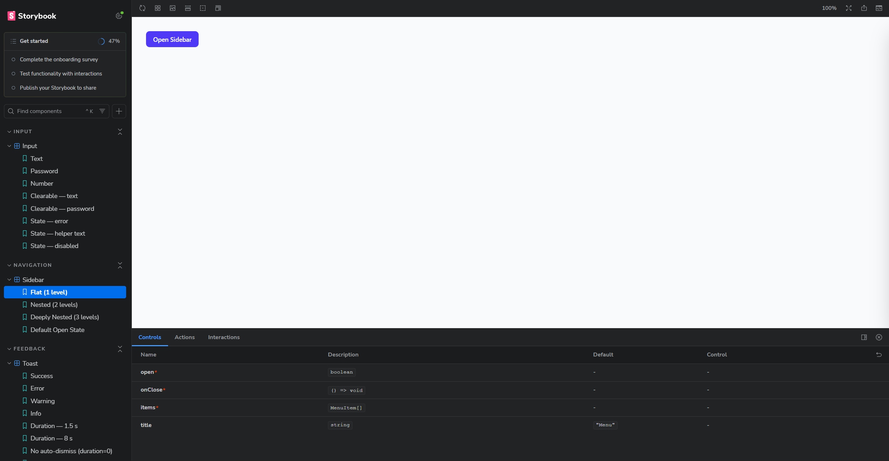
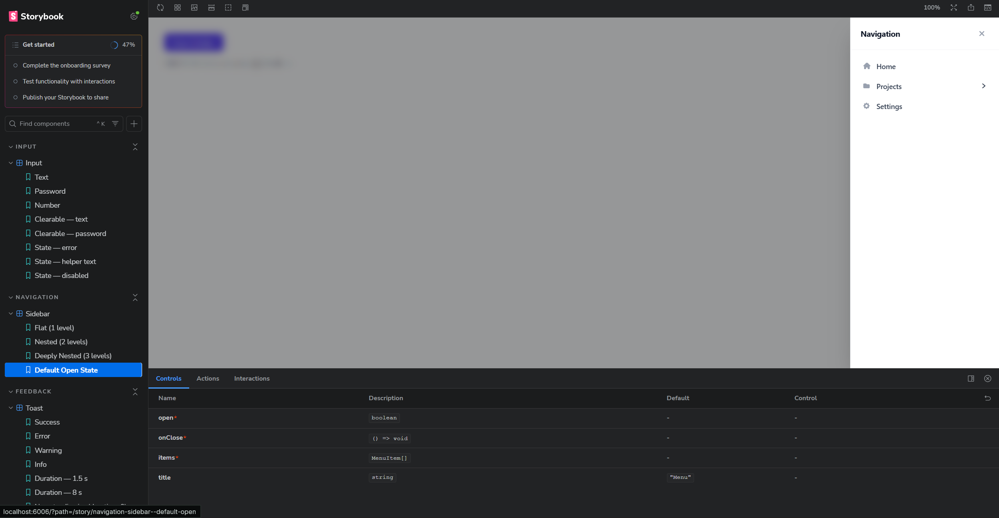

# 🧩 Component Library

A set of reusable React components built with **Next.js** and **Tailwind CSS**, documented and previewed in **Storybook**.

---

## 📦 Components

| Component | Category | File                             |
| --------- | -------- | -------------------------------- |
| `Input`   | Input    | `components/Input/Input.tsx`     |
| `Toast`   | Toast    | `components/Toast/Toast.tsx`     |
| `Sidebar` | Sidebar  | `components/Sidebar/Sidebar.tsx` |

---

## 🚀 Running Storybook

```bash
npm run storybook
```

Open [http://localhost:6006](http://localhost:6006). Components are organized in the left sidebar under **Input**, **Feedback**, and **Navigation**.

---

## 📥 Input

A flexible text field with built-in password toggle and clearable button.

### Props

| Prop           | Type                                                      | Default  | Description                              |
| -------------- | --------------------------------------------------------- | -------- | ---------------------------------------- |
| `type`         | `"text" \| "password" \| "number" \| "email" \| "search"` | `"text"` | Input type                               |
| `placeholder`  | `string`                                                  | —        | Placeholder text                         |
| `value`        | `string`                                                  | —        | Controlled value                         |
| `defaultValue` | `string`                                                  | —        | Uncontrolled starting value              |
| `clearable`    | `boolean`                                                 | `false`  | Shows × button when field has content    |
| `label`        | `string`                                                  | —        | Label shown above the input              |
| `helperText`   | `string`                                                  | —        | Grey hint shown below the input          |
| `error`        | `string`                                                  | —        | Red error message (overrides helperText) |
| `disabled`     | `boolean`                                                 | `false`  | Disables the input                       |
| `onChange`     | `(value: string) => void`                                 | —        | Fires on every keystroke                 |
| `onClear`      | `() => void`                                              | —        | Fires when × is clicked                  |

### Usage

```tsx
import { Input } from "@/components/Input/Input";


<Input label="Full name" placeholder="Jane Doe" />


<Input type="password" label="Password" />

<Input clearable label="Search" defaultValue="hello world" />


<Input label="Email" error="Please enter a valid email." />


const [val, setVal] = useState("");
<Input value={val} onChange={setVal} />
```

### Screenshots

**Password field — hidden** · Eye icon sits on the right, clicking it reveals the text


**Password field — focused** · Indigo ring appears when the field is active



---

## 🔔 Toast

A non-blocking notification that slides in from the bottom-right corner and auto-dismisses after a configurable delay.

### Props

| Prop       | Type                                          | Default  | Description                                      |
| ---------- | --------------------------------------------- | -------- | ------------------------------------------------ |
| `message`  | `string`                                      | —        | Text to display                                  |
| `type`     | `"success" \| "error" \| "warning" \| "info"` | `"info"` | Visual variant                                   |
| `duration` | `number`                                      | `3000`   | Auto-dismiss delay in ms — set to `0` to disable |
| `closable` | `boolean`                                     | `true`   | Show a manual × close button                     |
| `onClose`  | `() => void`                                  | —        | Called after the exit animation ends             |

### Variants

| `type`    | Colour | Use case            |
| --------- | ------ | ------------------- |
| `success` | Green  | Saved, completed    |
| `error`   | Red    | Failed, invalid     |
| `warning` | Amber  | Expiring, watch out |
| `info`    | Blue   | FYI, updates        |

### Usage in your app

**Step 1 — Wrap your layout** (`app/layout.tsx`):

```tsx
import { ToastProvider } from "@/components/Toast/Toast";

export default function RootLayout({ children }) {
  return (
    <html>
      <body>
        <ToastProvider>{children}</ToastProvider>
      </body>
    </html>
  );
}
```

**Step 2 — Trigger from any component:**

```tsx
import { useToast } from "@/components/Toast/Toast";

export function SaveButton() {
  const { show } = useToast();

  return (
    <button onClick={() => show({ type: "success", message: "Saved!" })}>
      Save
    </button>
  );
}
```

### Screenshots

**Success toast** · Green variant slides in from the right, auto-dismisses after 3 s



**Info toast with close button** · Blue variant, the × lets users dismiss it manually



---

## 📚 Sidebar

A slide-in navigation drawer from the right side of the screen with nested accordion menus.

### Props

| Prop      | Type         | Default  | Description                          |
| --------- | ------------ | -------- | ------------------------------------ |
| `open`    | `boolean`    | —        | Controls visibility                  |
| `onClose` | `() => void` | —        | Called when backdrop or × is clicked |
| `items`   | `MenuItem[]` | —        | Menu structure (see below)           |
| `title`   | `string`     | `"Menu"` | Header title                         |

### MenuItem shape

```ts
interface MenuItem {
  id: string;
  label: string;
  icon?: ReactNode;
  href?: string;
  children?: MenuItem[];
  onClick?: () => void;
}
```

### Usage

```tsx
import { useState } from "react";
import { Sidebar } from "@/components/Sidebar/Sidebar";
import type { MenuItem } from "@/components/Sidebar/Sidebar";

const items: MenuItem[] = [
  { id: "home", label: "Home", href: "/" },
  {
    id: "products",
    label: "Products",
    children: [
      { id: "products-a", label: "Product A", href: "/products/a" },
      { id: "products-b", label: "Product B", href: "/products/b" },
    ],
  },
  { id: "contact", label: "Contact", href: "/contact" },
];

export function Nav() {
  const [open, setOpen] = useState(false);

  return (
    <>
      <button onClick={() => setOpen(true)}>Menu</button>
      <Sidebar open={open} onClose={() => setOpen(false)} items={items} />
    </>
  );
}
```

### Keyboard & Accessibility

- Press `Esc` to close
- Click the semi-transparent backdrop to close
- `role="dialog"` and `aria-modal="true"` for screen readers
- Body scroll is locked while the sidebar is open

### Screenshots

**Closed state** · The trigger button is ready; the controls panel shows the accepted props



**Open state** · Panel slides in from the right, backdrop dims the page; nested items expand on click



---

## 🗂 Storybook Structure

```
stories/
├── Input.stories.tsx
├── Toast.stories.tsx
└── Sidebar.stories.tsx
```

```

---

## 📁 Full File Structure

```

.storybook/
├── main.ts  
└── preview.ts

app/
└── globals.css

components/
├── Input/Input.tsx
├── Toast/Toast.tsx
└── Sidebar/Sidebar.tsx

stories/
├── Input.stories.tsx
├── Toast.stories.tsx
└── Sidebar.stories.tsx

public/
├── pas1.png ← Input screenshot (focused)
├── pas2.png ← Input screenshot (default)
├── toast1.png ← Toast success screenshot
├── toast2.png ← Toast info with close button
├── side.png ← Sidebar closed screenshot
└── side1.png ← Sidebar open screenshot

tailwind.config.ts ← content[] must include components/** and stories/** so Tailwind scans them

```

```
